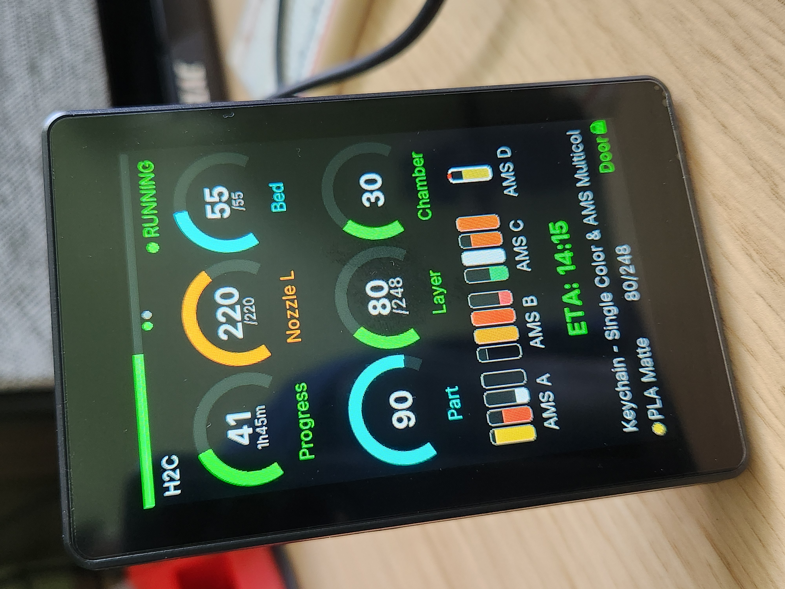
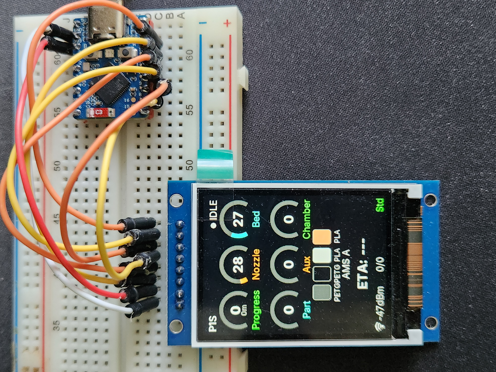
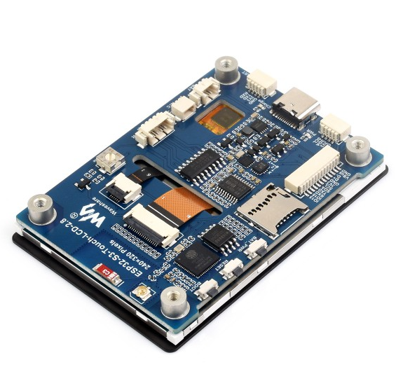

# BambuHelper

Dedicated Bambu Lab printer monitor built with ESP32-S3 Super Mini and a 1.54" 240x240 color TFT display (ST7789).

Connects to your printer via MQTT over TLS and displays a real-time dashboard with arc gauges, animations, live stats, and optional buzzer notifications.

Additional supported boards include Guition JC3248W535 320x480, CYD 240x320, Waveshare ESP32-S3-Zero (with 240x240 or 240x320 panel), Waveshare 2" 240x320, Waveshare 1.54" 240x240, and ESP32-C3 DIY builds using the same 240x240 display as the ESP32-S3 version.

> **One-click setup:** as of v3.2, you can flash your board and configure WiFi entirely from the browser at **[keralots.github.io/BambuHelper](https://keralots.github.io/BambuHelper/)** - no PlatformIO, no esptool, no captive portal hopping.

### Supported Printers

| Connection Mode | Printers | How it connects |
|---|---|---|
| **LAN Direct** | P1P, P1S, X1, X1C, X1E, A1, A1 Mini | Local MQTT via printer IP + LAN access code |
| **LAN Direct (Developer Mode)** | H2S, H2C, H2D | LAN-only mode + Developer Mode required - see note below |
| **Bambu Cloud (All printers)** | Any Bambu printer | Cloud MQTT via access token - no LAN mode needed |

> **H2 series LAN mode:** H2S, H2C, and H2D printers require both **LAN-only mode** and **Developer Mode** enabled in printer settings for local MQTT to work. Without Developer Mode, the printer accepts connections but does not respond to status requests. If you prefer not to enable Developer Mode, use Bambu Cloud mode instead.

> **Tip:** Use "Bambu Cloud (All printers)" if you don't want to enable LAN/Developer mode on your printer (for example to keep Bambu Handy working), if your ESP32 is on a different network than the printer, or if your printer only supports cloud mode (P2S).

### Cloud Mode Security Notice

When using Bambu Cloud, BambuHelper connects through Bambu Lab's cloud MQTT service. Here is what you need to know:

- **No credentials are stored** - BambuHelper never asks for your email or password. You extract an access token from your browser and paste it into the web interface.
- **Only the access token is stored** in the ESP32's flash memory. This token expires after about 3 months, at which point you simply paste a new one.
- **Read-only access** - BambuHelper only reads printer status. It never sends commands or modifies printer settings.
- **Same approach as other community projects** - this is the same authentication method used by the [Home Assistant Bambu Lab integration](https://github.com/greghesp/ha-bambulab), [OctoPrint-Bambu](https://github.com/jneilliii/OctoPrint-BambuPrinter), and other trusted third-party tools.

## Supported Boards

| Preview | Board | Notes |
|---|---|---|
|  | **ESP32-S3 Super Mini + 1.54" ST7789** | Base implementation this project started from. Uses an ESP32-S3 Super Mini with a `1.54"` TFT SPI ST7789 (`240x240`) display. Use the `esp32s3` firmware build. Supports **up to 2 printers**. |
|  | **Guition JC3248W535** | `320x480` IPS all-in-one board with **AXS15231B QSPI** display driver, ESP32-S3-N16R8 (`16MB` flash / `8MB` PSRAM), and capacitive touch (AXS15231B touch controller on I2C). Use the `jc3248w535` firmware build. Supports **up to 2 printers**. Currently in **beta** while layout polish continues. Initial port contributed by Niels ([@theNailz](https://github.com/theNailz)). AliExpress: [pl.aliexpress.com/item/1005007566315926.html](https://pl.aliexpress.com/item/1005007566315926.html) |
|  | **Waveshare ESP32-S3-Touch-LCD-2** | `240x320` ST7789 version with ESP32-S3, sold as a more plug-and-play option. Use the `ws_lcd_200` firmware build. Supports **up to 2 printers**, like the main ESP32-S3 DIY version. Product page: [waveshare.com/esp32-s3-touch-lcd-2.htm](https://www.waveshare.com/esp32-s3-touch-lcd-2.htm) Case (Horizontal and vertical): [MakerWorld model](https://makerworld.com/en/models/2773835) |
|  | **Waveshare ESP32-S3-Touch-LCD-1.54** | `240x240` ST7789 with ESP32-S3, touchscreen, battery holder, and 3 built-in buttons. Use the `ws_lcd_154` firmware build. Supports **up to 2 printers**. The left button (BOOT) works as a screen switcher alongside the touchscreen. **Battery power:** press and hold the center PWR button to power on. To power off, hold the left (BOOT) and right buttons simultaneously for 1.5 seconds. Product page: [waveshare.com/esp32-s3-touch-lcd-1.54.htm](https://www.waveshare.com/esp32-s3-touch-lcd-1.54.htm) |
|  | **ESP32-C3 Super Mini** | DIY version, just like the main ESP32-S3 build, using the same `240x240` ST7789 display. Use the `esp32c3` firmware build. Due to RAM limits, this board supports **1 printer only**. |
|  | **Waveshare ESP32-S3-Zero + 1.54" ST7789** | DIY version for the ESP32-S3FH4R2 module with `4MB` flash and `2MB` PSRAM. Use the `esp32s3_zero` firmware build. It uses the same external ST7789 wiring as the ESP32-S3 Super Mini build and supports **up to 2 printers**. GPIO21 is occupied by the onboard WS2812 RGB LED. Product page: [waveshare.com/esp32-s3-zero.htm](https://www.waveshare.com/esp32-s3-zero.htm) |
|  | **Waveshare ESP32-S3-Zero + 2.0" ST7789V (240x320)** | DIY variant of the ESP32-S3-Zero build using a larger `240x320` **ST7789V** panel module instead of the 1.54" 240x240. Same pinout as the standard `esp32s3_zero` build - only the panel differs (driven through the existing 240x320 layout). Use the `esp32s3_zero_320` firmware build. Supports **up to 2 printers**. Display module (AliExpress): [pl.aliexpress.com/item/1005007523612119.html](https://pl.aliexpress.com/item/1005007523612119.html) |
|  | **CYD / ESP32-2432S028** (ILI9341) | `240x320` **ILI9341** all-in-one board. Use the `cyd` firmware build. Due to RAM limits, this board supports **1 printer only**. When flashing from [ESP Web Flasher](https://espressif.github.io/esptool-js/), set **Baudrate: 115200** before clicking **Connect**. If the first attempt fails, click **Disconnect** and then **Connect** again without unplugging the USB cable. If colors look reversed (white background instead of dark), enable **Invert display colors (fix white background)** in the web UI under **Display**. Case shown in the photo: [MakerWorld model](https://makerworld.com/models/2721746). |

### Additional Boards (Hardware Not Owned by Maintainer)

> Firmware for these boards exists and builds cleanly, but the maintainer doesn't physically own the hardware. They may require custom toolchain forks, aren't validated on every release, and individual features (e.g. touch) might still be experimental. For issues specific to these boards, please ping the listed maintainer / tester.

| Preview | Board | Notes | Maintainer / Tester |
|---|---|---|---|
|  | **Seeed SenseCAP Indicator** | `480x480` ST7701S RGB panel with ESP32-S3, FT5X06 capacitive touch, `8MB` flash with OPI PSRAM, all-in-one industrial enclosure. Use the `sensecap_indicator` firmware build. Supports **up to 2 printers**. Requires custom forks of `arduino-esp32` (TCA9535 IO expander) and `LovyanGFX` (ST7701S RGB panel), both pinned to specific commits in `boards/sensecap_indicator.ini`. Product page: [seeedstudio.com/SenseCAP-Indicator-D1-p-5695.html](https://www.seeedstudio.com/SenseCAP-Indicator-D1-p-5695.html) | [@kjames2001](https://github.com/kjames2001) |
|  | **Waveshare ESP32-S3-Touch-LCD-2.8** | `240x320` ST7789 with ESP32-S3 and **CST328** capacitive touch (different chip from the 2.0" board, so the `ws_lcd_200` firmware will boot but the screen stays black). Use the `ws_lcd_280` firmware build. Same 240x320 layout as the 2.0" - supports **up to 2 printers**. Battery / IMU / audio not wired up in firmware. Pinout from the [Waveshare wiki](https://www.waveshare.com/wiki/ESP32-S3-Touch-LCD-2.8). Product page: [waveshare.com/esp32-s3-touch-lcd-2.8.htm](https://www.waveshare.com/esp32-s3-touch-lcd-2.8.htm) | [@FranciscoSaoMarcos](https://github.com/FranciscoSaoMarcos) |
|  | **CYD / TZT L1435-2.4** (ST7789) | Looks almost identical to the standard CYD, but uses a `240x320` **ST7789V** panel (instead of ILI9341) and the backlight is on GPIO27. Use the `tzt_2432` firmware build - the regular `cyd` build will give you a black screen on this hardware. Due to RAM limits, this board supports **1 printer only**. Often sold on Aliexpress as *"TZT ESP32 LVGL 2.4 inch LCD TFT 240*320 With Touch"*. | _community_ |

## Features

- **One-click web flasher** - install firmware directly from [keralots.github.io/BambuHelper](https://keralots.github.io/BambuHelper/) in desktop Chrome/Edge - no PlatformIO, no esptool, no flash offsets
- **In-browser WiFi setup (Improv-Serial)** - on first boot the install dialog asks for your WiFi over USB; no captive-portal switching needed (AP fallback still available)
- **Live dashboard** - progress arc, temperature gauges, fan speed, layer count, time remaining
- **H2-style LED progress bar** - full-width glowing bar inspired by Bambu H2 series
- **Anti-aliased arc gauges** - smooth nozzle and bed temperature arcs with color zones
- **AMS visualization** - per-tray colors, drying status, plus an optional bottom-row strip view on 240x240 screens, configurable per printer
- **Tasmota power monitoring** - per-printer smart plug with live wattage, per-print kWh + cost, and optional auto-off after print finishes (with hot-end gate)
- **Animations** - loading spinner, progress pulse, completion celebration
- **Web config portal** - dark-themed settings page for WiFi, network, printer, display, power, buzzer, and LED settings
- **Network configuration** - DHCP or static IP, with optional IP display at startup
- **Display auto-off** - configurable timeout after print completion, auto-off when printer is off
- **NVS persistence** - all settings survive reboots
- **Auto AP mode** - creates WiFi hotspot on first boot or when WiFi is lost
- **Smart redraw** - only redraws changed UI elements for smooth performance
- **Customizable gauge colors** - per-gauge arc/label/value colors with preset themes
- **Multi-printer support** - monitor up to 2 printers simultaneously on full-RAM boards (ESP32-S3 family); CYD, TZT, and ESP32-C3 have an experimental opt-in 2-printer mode but default to 1 printer
- **Smart rotation** - automatically shows the printing printer; cycles between both when both are printing
- **Physical button / touchscreen** - cycle printers and wake display via optional push button or TTP223, board-built-in buttons (Waveshare 1.54"), or the built-in capacitive touchscreens on CYD / TZT / Waveshare 2" / Waveshare 1.54"
- **Optional LED** - PWM-driven status LED on a user-configurable pin; hold the button/touch to dim
- **Optional buzzer** - passive buzzer notifications for print finished, connected, and error events; Waveshare 1.54" uses its built-in ES8311 audio codec instead
- **OTA updates** - update firmware from the device's web interface (manual upload or one-click from GitHub Releases)
- **Battery support (Waveshare 2" and 1.54")** - on-screen battery indicator, charging detection, hold-to-power-off
- **Exponential backoff** - reconnect attempts to offline printers gradually slow down to conserve resources

## Hardware Assembly for the DIY Version (ESP32-S3 Super Mini)

> **If you bought an all-in-one board** (CYD, TZT L1435-2.4, Waveshare 2" or 1.54", SenseCAP Indicator), **skip this section** - everything is already wired on the PCB. The tables below apply only to the **DIY** builds (ESP32-S3 SuperMini, ESP32-S3-Zero, ESP32-C3 SuperMini) that need an external display soldered up.

AliExpress links (DIY parts):
- Display 1.54" ST7789: https://a.aliexpress.com/_EG9y7wc
- ESP32-S3 SuperMini: https://a.aliexpress.com/_Eyk9GdA (the **S3** variant supports 2 printers; the **C3** variant supports 1 printer. If you use C3, the wiring is different; check the default wiring table)
- Case for the 1.54" DIY build: https://makerworld.com/en/models/2501721

Optional accessories - all configurable from the web interface, none required:
- **Touch / push button** (TTP223 or standard push button) for cycling printers and waking the display. See the wiring section below.
- **Passive buzzer / mini speaker** for print-finished, connected, and error notifications. See the wiring section below.
- **Status LED** (any common LED with a series resistor) for at-a-glance progress / connection state. See the wiring section below.

Links for optional accessories:
- TTP223 touch button: https://aliexpress.com/item/1005006246380749.html
- LDO6AJSA LED driver: https://aliexpress.com/item/1005005344841325.html
- Filament LED 3V 39 mm: https://aliexpress.com/item/1005007883702652.html
- Passive buzzer: https://aliexpress.com/item/1005010400627387.html

### Default Wiring

| Display Pin ST7789 (240x240) | ESP32-S3 GPIO | ESP32-S3-Zero GPIO | ESP32-C3 GPIO |
|---|---|---|---|
| MOSI (SDA) | 11 | 11 | 20 |
| SCLK (SCL) | 12 | 12 | 21 |
| CS | 10 | 10 | 6 |
| DC | 9 | 9 | 7 |
| RST | 8 | 8 | 10 |
| BL | 13 | 13 | 5 |
| GND | GND | GND | GND |
| VCC | 3.3V | 3.3V | 3.3V |

Adjust pin assignments in `platformio.ini` `build_flags` to match your wiring (only needed if you are flashing from source; the prebuilt binaries use the defaults above).

> **ESP32-S3-Zero:** GPIO21 is connected to the onboard WS2812 RGB LED, so it cannot be reused as a status-LED GPIO. The firmware refuses to enable LED output on GPIO21.

### Optional Input: Button, Touch Sensor, or Touchscreen

Cycles between printers, wakes the display from sleep, and (when held) dims the optional status LED. All input methods are configured from the web interface under **Multi-Printer** - no recompilation needed.

**Built-in touchscreens** (no wiring needed):
- **CYD / ESP32-2432S028** - XPT2046 resistive touch, automatic
- **TZT L1435-2.4** - XPT2046 resistive touch, same pins as CYD, automatic
- **Waveshare ESP32-S3-Touch-LCD-2** - CST816D capacitive on I2C (GPIO48/47), automatic
- **Waveshare ESP32-S3-Touch-LCD-1.54** - CST816 capacitive on I2C (GPIO42/41), plus three hardware buttons - BOOT (GPIO0), PWR centre (GPIO5), AUX (GPIO4)
- **Waveshare ESP32-S3-Touch-LCD-2.8** - CST328 capacitive on I2C (GPIO1/3), reset on GPIO2, automatic
- **Guition JC3248W535** - AXS15231B capacitive touch on I2C (GPIO4/8), polled (no IRQ wired), automatic

**External TTP223 capacitive touch sensor** (DIY ESP32-S3 / ESP32-S3-Zero / ESP32-C3 builds):

| TTP223 Pin | ESP32-S3 GPIO | ESP32-S3-Zero GPIO | ESP32-C3 GPIO |
|---|---|---|---|
| `VCC` | `3.3V` | `3.3V` | `3.3V` |
| `GND` | `GND` | `GND` | `GND` |
| `SIG` | `GPIO 4` | `GPIO 4` | `GPIO 4` |

**Standard push button:** connect one leg to `GPIO 4` and the other to `GND`. The internal pull-up is enabled automatically. Select **Push Button** in the web interface.

### Optional Buzzer Wiring

The buzzer is completely optional. If you do not connect one, BambuHelper works normally.

Use a **passive buzzer** (or a mini speaker on CYD) and connect it like this:

| Buzzer Pin | ESP32-S3 GPIO | ESP32-C3 GPIO | CYD GPIO |
|---|---|---|---|
| `+` / `SIG` | `GPIO 5` | `GPIO 3` | `GPIO 26` |
| `-` / `GND` | `GND` | `GND` | `GND` |

> **CYD speaker:** The CYD board has a dedicated speaker connector on the PCB - just plug a mini speaker into it and set the buzzer pin to `GPIO 26` in the web interface.

> **Note:** The firmware default buzzer pin is `GPIO 5` on both ESP32-S3 and ESP32-C3. The table above shows the **recommended wiring**. If you wire an ESP32-C3 buzzer to `GPIO 3`, you must change the buzzer pin to `GPIO 3` in the web interface after the first boot.
You can change the buzzer GPIO later in the web interface under **Buzzer**. The buzzer can be used for print-finished, connected, and error notifications.

> **Waveshare ESP32-S3-Touch-LCD-1.54** has a built-in **ES8311 audio codec** + speaker on its own pins (no buzzer GPIO to set) - it produces the same notifications using the onboard amplifier. No external buzzer needed.

### Optional Status LED Wiring

A single PWM-driven status LED can be wired to any free GPIO. Configure the pin and behaviour (heartbeat, finish flash, off) from the web interface under **LED**.

Wiring is done using: LD06AJSA Constant Current driver

Things to know:

- The pin is set in the web UI - there is no default. The setting starts **disabled** with pin `0`.
- The firmware refuses to attach the LED to the configured buzzer pin or the configured button pin (it will silently disable LED output to avoid a conflict).
- On **ESP32-S3-Zero**, GPIO21 is reserved for the onboard WS2812 RGB LED and cannot be selected.
- The LED is also a dimmer target: **hold the optional button / touchscreen** to ramp brightness down/up while the LED is on. The chosen brightness is debounced and saved to NVS after ~2 s of release.
- Inverted-logic wiring (LED to VCC instead of GND) is not currently supported - the firmware always drives the pin active-HIGH.

### Complete wiring example for ESP32-S3 Super Mini and ST7789 (240x240) display.


### Assembly Video

[](https://youtu.be/hsyamsU5UZE)

## Flashing

### Easy: BambuHelper Web Flasher (recommended for first-time setup)

Open **[keralots.github.io/BambuHelper](https://keralots.github.io/BambuHelper/)** in Chrome or Edge on a desktop or laptop, pick your board, plug it in over USB, and click **Install**. That's it - no downloads, no offsets, no baudrate dialogs.

After the flash, the install dialog runs a 3-minute **Configure WiFi** step right in the browser using Improv-Serial - type your home SSID/password and the device joins your network without you ever having to connect to the captive portal. The device still falls back to AP mode (showing the SSID and password on its screen) if you dismiss the dialog or run out of time.

Supports the 9 most common boards (ESP32-S3 SuperMini, ESP32-S3-Zero, ESP32-C3 SuperMini, Waveshare ESP32-S3-Touch-LCD-2, Waveshare ESP32-S3-Touch-LCD-1.54, Waveshare ESP32-S3-Touch-LCD-2.8, Guition JC3248W535, CYD / ESP32-2432S028, TZT L1435-2.4). For the community-maintained SenseCAP Indicator use the manual flow below.

### Manual: Generic ESP Web Flasher

1. Download the latest firmware from [Releases](../../releases). **If you are flashing a new device for the first time**, use the file ending with **-Full** (for example `BambuHelper-esp32s3-v3.3-Full.bin`). The regular `-ota.bin` file is for OTA updates on devices that already have BambuHelper installed.
2. Open [ESP Web Flasher](https://espressif.github.io/esptool-js/) in Chrome or Edge
3. If you are flashing a **CYD** or **TZT L1435-2.4**, set **Baudrate** to **115200** before clicking **Connect**. Two or more attempts may be needed - the first one will fail. This applies to both CYD-shaped boards (they use a CH340 USB-Serial chip that does not tolerate high baud rates on first contact).
4. Connect your ESP32 via USB
5. Click **Connect** and select your device
6. Set flash address to **0x0**
7. Select the downloaded `.bin` file
8. Click **Program**

### Updating an Existing Device (OTA)

Once you have BambuHelper running, you do not need to re-flash over USB to update. From the device's web interface:

1. Open the device's IP in a browser
2. Scroll to **Other** -> **OTA Update**
3. Click **Check for updates** - the device queries GitHub Releases and, if a newer build is available, shows a one-click **Install Update** button that pulls the matching `*-ota.bin` straight from the release
4. If you prefer to upload manually (e.g. a custom build), the same panel accepts a local `*-ota.bin` file via drag-and-drop

The device reboots automatically once the update is written; the web page reloads when it comes back online.

### Build Files

| Board | Use this `Full` file for first flash / recovery |
|---|---|
| ESP32-S3 Super Mini | `BambuHelper-esp32s3-v3.3-Full.bin` |
| Guition JC3248W535 | `BambuHelper-jc3248w535-v3.3-Full.bin` |
| Waveshare ESP32-S3-Zero | `BambuHelper-esp32s3_zero-v3.3-Full.bin` |
| CYD / ESP32-2432S028 | `BambuHelper-cyd-v3.3-Full.bin` |
| TZT L1435-2.4 | `BambuHelper-tzt_2432-v3.3-Full.bin` |
| Waveshare ESP32-S3-Touch-LCD-2 | `BambuHelper-ws_lcd_200-v3.3-Full.bin` |
| Waveshare ESP32-S3-Touch-LCD-1.54 | `BambuHelper-ws_lcd_154-v3.3-Full.bin` |
| Waveshare ESP32-S3-Touch-LCD-2.8 | `BambuHelper-ws_lcd_280-v3.3-Full.bin` |
| ESP32-C3 Super Mini | `BambuHelper-esp32c3-v3.3-Full.bin` |

> Community boards (ESP32-S3-Zero with 2.0" 240x320 panel, SenseCAP Indicator) are not part of the automated release pipeline - build them locally with `pio.exe run -e <env>` and flash the resulting `.pio/build/<env>/firmware.bin`.

## Setup

### Configuration Guide

[](https://youtu.be/n2RdbeHTMz0)

> **If you used the web flasher**, steps 2-4 happen automatically in the install dialog (Configure WiFi step). The device joins your home WiFi straight away and the dialog gives you a link to its IP - jump to step 5. The AP captive-portal path below is the fallback when you skipped or timed out of the Configure WiFi dialog, or when you flashed via the generic ESP Web Flasher.

1. **Flash** the firmware (see above)
2. **Connect** to the `BambuHelper-XXXX` WiFi network (password: `bambu1234`)
3. **Open** `192.168.4.1` in your browser
4. **Enter** your home WiFi credentials and **Save** - the device restarts and connects to your WiFi
5. **Note the IP address** shown on the ESP32 display after it connects to WiFi
6. **Open** that IP address in your browser to access the full web interface
7. **Configure your printer:**

   **LAN Direct** (P1P, P1S, X1, X1C, X1E, A1, A1 Mini):
   - Printer IP address (found in printer Settings > Network)
   - Serial number (see note below)
   - LAN access code (8 characters, from printer Settings > Network)

   **Bambu Cloud (All printers)**:
   - Get your Bambu Cloud access token from your browser (see [Getting a Cloud Token](#getting-a-cloud-token) below)
   - Paste the token into the web interface
   - Enter your printer's serial number (see note below)

   > **Important: Serial number is NOT the printer name.** The serial number is a 15-character code (for example `01P00A000000000`) found on the printer LCD under **Settings > Device > Serial Number**, or on the physical label on the back or bottom of the printer. Do not confuse it with the printer name shown in Bambu Studio (for example `3DP-01P-110`), which is a shortened version and will not work.

8. **Save Printer Settings** - the device connects to your printer

### Getting a Cloud Token

To use cloud mode, you need an access token from your Bambu Lab account. The easiest way is to copy it from your browser cookies on https://bambulab.com (you must be logged in).

**Using browser DevTools (Chrome / Edge):**
1. Open https://bambulab.com and log in to your account
2. Press **F12** to open DevTools
3. Go to the **Application** tab (click `>>` if you do not see it)
4. In the left sidebar, expand **Cookies** -> click `https://bambulab.com`
5. Find the row named `token` in the cookie list
6. Double-click the **Value** cell to select it, then **Ctrl+C** to copy
7. Paste the value into BambuHelper's "Access Token" field in the web interface

**Using browser DevTools (Firefox):**
1. Open https://bambulab.com and log in to your account
2. Press **F12** to open DevTools
3. Go to the **Storage** tab
4. In the left sidebar, expand **Cookies** -> click `https://bambulab.com`
5. Find the row named `token`
6. Double-click the **Value** cell to select it, then **Ctrl+C** to copy
7. Paste the value into BambuHelper's "Access Token" field

**Using browser DevTools (Safari):**
1. Open https://bambulab.com and log in to your account
2. Open **Develop** -> **Show Web Inspector** (enable the Develop menu first in Safari Preferences -> Advanced)
3. Go to the **Storage** tab -> **Cookies** -> `bambulab.com`
4. Find and copy the `token` value
5. Paste it into BambuHelper's "Access Token" field

> **Note:** The token is valid for approximately 3 months. When it expires, the ESP32 will fail to connect - simply repeat the process above to get a fresh token and paste it in the web interface. Make sure to select the correct **Server Region** (US/EU/CN) to match your Bambu account's region.

**Optional: Companion Tool for one-click setup**

If you'd rather skip the copy-paste flow entirely, the [Companion Tool](tools/DIAGNOSTICS-HOWTO.md) (`tools/BambuHelper-CompanionTool.exe` on Windows, `python tools/bambu_diag.py` on Mac/Linux) logs into your Bambu account, fetches your printer list, and pushes the token + serial straight to BambuHelper over your LAN - no copying, no pasting. Pick "Configure BambuHelper device" from its menu.

> **Browser cookie token expires very quickly (after one session, on next reboot, etc.)?** Try the Companion Tool instead - tokens obtained that way tend to be more stable than browser cookies that get invalidated unexpectedly soon after extraction.

### Custom Smooth Fonts

BambuHelper embeds smooth fonts directly in the firmware as VLW tables in `PROGMEM`. The default font is **Inter** (Regular for small/body, Bold for large headings), shipped as TTF in `fonts/` and pre-converted to C headers in `include/fonts/`. Swapping the font means regenerating those headers and reflashing - there is no runtime upload, because the font lives in flash next to the code.

Steps:

1. Drop your `.ttf` files into `fonts/` (e.g. `MyFont-Regular.ttf`, `MyFont-Bold.ttf`).
2. Edit the `FONTS` list in [`scripts/generate_vlw_fonts.py`](scripts/generate_vlw_fonts.py) - each entry is `(output_name, ttf_filename, pixel_size)`. Keep the three names `inter_10`, `inter_14`, `inter_19` unless you also rename the includes in `src/fonts.cpp`.
3. Install the converter dependency once: `pip install freetype-py`.
4. Regenerate the headers:
   ```bash
   python scripts/generate_vlw_fonts.py
   ```
5. Rebuild the firmware for your target:
   ```bash
   pio.exe run -e cyd
   ```
6. Flash the new `.pio/build/<env>/firmware.bin` over USB or push it OTA via the web UI's firmware update page.

Tips:

- Pick a font that renders well at small pixel sizes - thin or highly stylised faces will look smudged at 10-14 px. Sans-serif faces designed for UI work best.
- Each VLW table grows roughly linearly with pixel size; the default Inter set is ~37 KiB total. Watch the flash usage line at the end of the build if you push to bigger sizes.
- Only printable ASCII (0x20-0x7E) and the degree symbol (0xB0) are baked in. Add codepoints by editing `CHARSET` in the generator.

## Web Interface

The built-in web interface (accessible at the device's IP address) provides the following settings:

### WiFi Settings
- **SSID** - your home WiFi network name
- **Password** - WiFi password

### Network
- **IP Assignment** - choose between DHCP (automatic) or Static IP
- **Static IP fields** (when static is selected):
  - IP Address
  - Gateway
  - Subnet Mask
  - DNS Server
- **Show IP at startup** - display the assigned IP on screen for 1.5 seconds after WiFi connects (on by default)

### Printer Settings
- **Connection Mode** - LAN Direct or Bambu Cloud (All printers)
- **LAN mode fields:**
  - Printer Name, Printer IP Address, Serial Number, LAN Access Code
- **Cloud mode fields:**
  - Server Region (US/EU/CN), Access Token, Printer Serial Number, Printer Name
- **Live Stats** - real-time nozzle/bed temp, progress, fan speed, and connection status

### Display
- **Brightness** - backlight level (10-255)
- **Screen Rotation** - 0, 90, 180, 270 degrees
- **Display off after print complete** - minutes to show the finish screen before turning off the display (0 = never turn off, default: 3 minutes)
- **Keep display always on** - override the timeout and never turn off
- **Show clock after print** - display a digital clock with date instead of turning off the screen (enabled by default)

### Gauge Colors
- **Theme presets** - Default, Mono Green, Neon, Warm, Ocean
- **Background color** - display background
- **Track color** - inactive arc background
- **Per-gauge colors** (arc, label, value) for:
  - Progress
  - Nozzle temperature
  - Bed temperature
  - Part fan
  - Aux fan
  - Chamber fan

### Buzzer
- **Buzzer (optional)** - enable or disable passive buzzer notifications
- **GPIO Pin** - choose which ESP32 pin drives the buzzer
- **Quiet Hours** - disable buzzer sounds during selected hours
- **Test Buttons** - quickly test available buzzer sounds from the web interface

### Other
- **Factory Reset** - erases all settings and restarts
- **OTA Update** - update firmware directly from the web interface

## Dashboard Screens

| Screen | When |
|---|---|
| Splash | Boot (2 seconds) |
| AP Mode | First boot / no WiFi configured |
| Connecting WiFi | Attempting WiFi connection |
| WiFi Connected | Shows IP for 1.5 seconds (if enabled) |
| Connecting Printer | WiFi connected, waiting for MQTT |
| Idle | Connected, printer not printing |
| Printing | Active print with full dashboard |
| Finished | Print complete with animation (auto-off after timeout) |
| Clock | After finish timeout (if enabled) - shows digital clock with date |
| Display Off | After finish timeout (if clock disabled) or printer powered off |

## Display Power Management

The display is managed from the **Display** section of the web interface (see above for the full list of fields). In short:

- After a print completes, the finish screen is shown for the configured number of minutes (default 3), then either a digital clock takes over or the display turns off.
- When the printer goes offline (powered off or disconnected), the display stays in whatever state it was in - it does not flicker back to the connecting screen.
- When the printer comes back online or starts a new print, the display wakes automatically.
- **Keep display always on** overrides the auto-off behaviour.
- **Show clock after print** (default on) chooses clock-over-off when the finish timer expires.

## Requirements

- For flashing: a desktop browser (Chrome or Edge) is enough - use the [web flasher](https://keralots.github.io/BambuHelper/). [PlatformIO](https://platformio.org/) is only needed if you want to modify the firmware yourself.
- **LAN mode:** Bambu Lab printer with LAN mode enabled, printer and ESP32 on the same local network
- **Cloud mode:** Bambu Lab account, ESP32 with internet access

## Multi-Printer Monitoring

BambuHelper supports monitoring up to 2 printers simultaneously via dual MQTT connections.

> **Low-RAM boards default to 1 printer.** Each MQTT connection takes ~85 KB of heap (TLS session + message buffer). The full-RAM boards (esp32s3, esp32s3_zero, esp32s3_zero_320, ws_lcd_200, ws_lcd_154, jc3248w535, ws_lcd_280, sensecap_indicator) run two printers comfortably. The low-RAM boards (**CYD**, **TZT L1435-2.4**, **ESP32-C3**) ship with a single printer slot by default, but expose an **experimental opt-in 2-printer mode** in **Printer Settings** - try it if you really need two, but expect tighter memory and the occasional disconnect under load.

### Rotation Modes

| Mode | Behavior |
|---|---|
| **Smart** (default) | Shows the printing printer. If both are printing, cycles between them. If neither is printing, shows last active. |
| **Auto-rotate** | Cycles through all connected printers at a configurable interval (10s - 10min). |
| **Off** | Manually switch between printers using the physical button only. |

### Physical Button

An optional physical button can be connected to cycle between printers and wake the display from sleep.

| Type | Wiring | How it works |
|---|---|---|
| **Push button** | One pin to configured GPIO, other pin to GND | Active LOW with internal pull-up |
| **TTP223 touch sensor** | VCC->3.3V, GND->GND, SIG->configured GPIO | Active HIGH |

The button type and GPIO pin are configurable in the web interface (Multi-Printer section) - no recompilation needed.

### MQTT Reconnect Backoff

When a printer is physically powered off, BambuHelper uses exponential backoff to avoid wasting resources on repeated connection attempts:

| Phase | Attempts | Interval |
|---|---|---|
| Normal | First 5 | Every 10 seconds |
| Phase 2 | Next 10 | Every 60 seconds |
| Phase 3 | Beyond 15 | Every 120 seconds |

When the printer comes back online, the backoff resets to normal immediately.

## Power Monitoring

| | |
|---|---|
|  | BambuHelper can display live power consumption from a **[Tasmota](https://tasmota.github.io/docs/)-flashed smart plug** connected to your printer. Tasmota is open-source firmware for ESP-based smart plugs that exposes a local HTTP API and MQTT - no cloud required.<br><br>**What it shows:**<br>- Live wattage in the bottom status bar on the idle and printing screens<br>- Total kWh used during the print job, shown on the "Print Complete" screen<br><br>**Setup:** open the web interface, go to **Power Monitoring**, enter the plug's local IP address, set your preferred poll interval (10-30s), and choose whether to alternate the watts display with the layer counter or always show watts.<br><br>**Requirements:** any Tasmota-flashed smart plug with energy monitoring (e.g. Sonoff S31, BlitzWolf BW-SHP6, Nous A1). The plug must be on your local network and reachable from the ESP32. No Tasmota MQTT broker needed - BambuHelper polls the HTTP API directly.<br><br>**Auto power-off:** each plug can power itself off N minutes (1-240) after the print finishes, with a 50&nbsp;°C nozzle gate so it never triggers while the hot end is hot. Configure under **Power Monitoring -> Auto-off**. |

## Troubleshooting

### WiFi won't connect / drops frequently

**SPI display cables near the ESP32 antenna can cause WiFi interference.** The ESP32-S3 Super Mini has a PCB antenna at one end of the board. If the SPI wires to the display run close to or over this antenna area, RF interference can prevent WiFi from connecting or cause frequent disconnections.

**Fix:** Route the display cables away from the antenna end of the ESP32-S3. Even 1-2 cm of separation can make a significant difference. If using a breadboard, ensure the wires do not loop back over the ESP32 module.

**Symptoms:**
- "Connecting to WiFi" screen appears briefly, then falls back to AP mode
- WiFi connects sometimes but drops after a few seconds
- Works fine when display is disconnected

**If WiFi issues persist**
Perform an antenna mod by soldering two individual goldpins to the antenna pads, as shown in the picture.


> **Check your external antenna orientation first.** On boards with a detachable IPEX/U.FL antenna (e.g. ESP32-C3), the antenna is often mounted the wrong way around. The white mark on the antenna is the input - simply rotating it to the correct orientation can fix poor WiFi reception, often better than soldering wires to the pads. See [issue #106](https://github.com/Keralots/BambuHelper/issues/106) - it may help as well.

### Printer shows "Connecting" but never connects

- **LAN Direct:** Make sure the printer and ESP32 are on the same network. Check that LAN mode is enabled on the printer and the access code is correct.
- **Bambu Cloud:** Verify the access token has not expired (about 3 months validity). Re-extract it from your browser and paste it again. Check the server region matches your Bambu account.
- If a printer is physically powered off, reconnect attempts will gradually slow down (backoff). It will reconnect automatically when the printer comes back online.

### Display shows wrong printer / does not switch

- Check rotation mode in the web interface (Multi-Printer section). Smart mode only switches automatically when a printer is actively printing.
- Press the physical button (if configured) to manually cycle between printers.

## Touchscreen Navigation & Camera Settings (Guition JC3248W535)

This fork contains custom features designed for the **Guition JC3248W535** board:
* **Configurable Camera Stream URL**: Set your custom camera stream URL directly in the **Display** section of the Web Interface.
* **On-Screen Touch Controls**: The touchscreen menu navigation has on-screen controls:
  * **Left-Top**: Renders an **OK** button to confirm/select the current menu item.
  * **Left-Bottom**: Renders **Up (`^`)** and **Down (`v`)** buttons to navigate through items on the right side of the screen.
  * **Touch & Hold** interaction has been completely removed in favor of instant touch/click responsiveness.
* **Simplified Menu**: Unused options like "Livestream Info" have been removed.

## License

MIT
